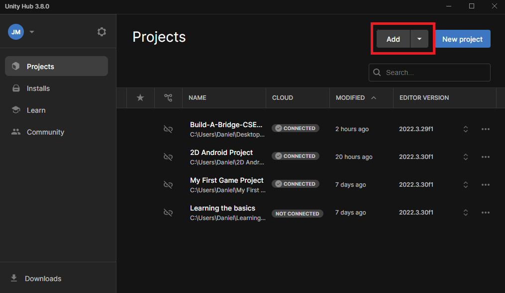
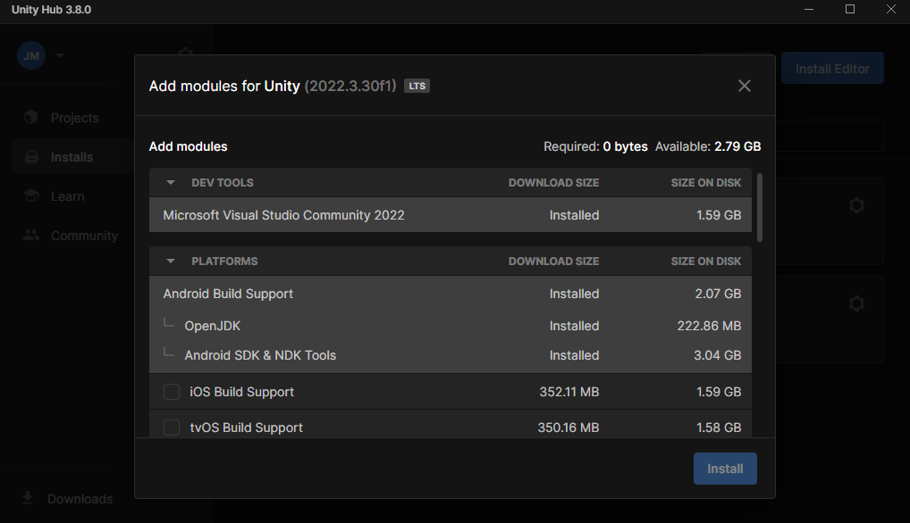
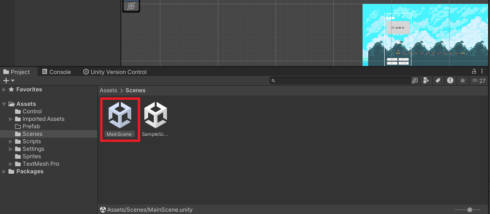
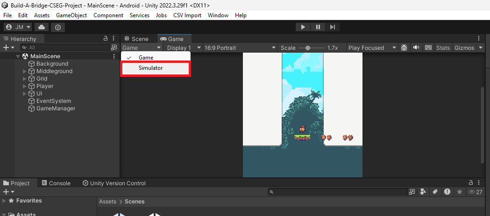
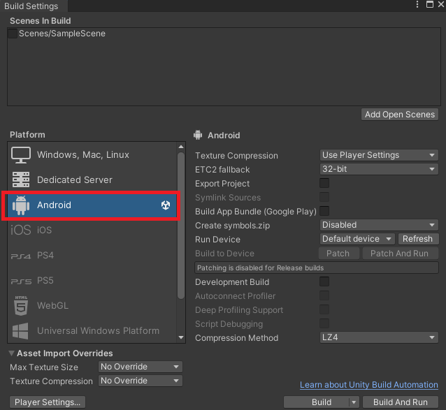

# Build A Bridge

An educational 2D Android-based game.

## Installation

1. Use [git](https://www.git-scm.com/) to clone the project.

```bash
git clone https://github.com/Jolayus/Build-A-Bridge-CSEG-Project.git
```

2. Add the project to your Unity Hub.


3. Install necessary modules.


4. Open the Main scene by double clicking the Assets/Scenes/MainScene.unity in the Project folder.


5. Open the game using device simulator.


6. Make sure the platform selected is Android. You can it by click "File" on the upper left window and click "Build Settings".


## Contributing

Create your own branch, "development-branch-<contributor_name>-<issue number>"
Pull requests are welcome. For major changes, please open an issue first
to discuss what you would like to change.

Please make sure to update tests as appropriate.
